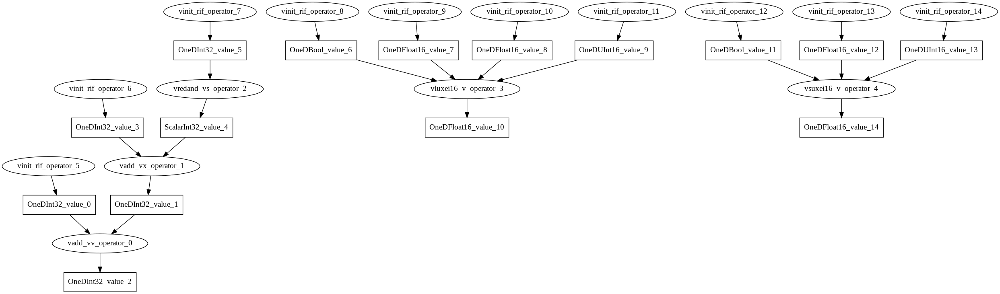

= RIF Design Writeup 
Version 1.1-draft
:doctype: article
:encoding: utf-8
:lang: en
:toc: left
:numbered:
:stem: latexmath
:le: &#8804;
:ge: &#8805;
:ne: &#8800;
:approx: &#8776;
:inf: &#8734;

== Introduction

NOTE: This document assumes you have basic understanding with the RISC-V
Vector (RVV) Extension and the intrinsic functions associated with it.
If not, please go to
https://github.com/riscv/riscv-v-spec[riscv-v-spec] and
https://github.com/riscv-non-isa/rvv-intrinsic-doc[rvv-intrinsic-doc].

This document records the design write-up and intents of RIF.
RIF is short for **R**VV **I**ntrinsic **F**uzzing, as we try to generate series
random test to fuzz and check if the compiler compiles C code that
contains RVV C intrinsics correctly. Essentially, you may see the current
RIF as a graph-based compiler that transforms the randomly generated
data-flow graph into testing C code.

Before RIF, there was already a fuzz-test generator called 
https://github.com/sifive/riscv-vector-tests[riscv-vector-tests].
It was built for fuzz-test on RVV. It served its purpose well and is an
important part of the CI. In the mean time, there is some place that may
be re-designed, and the trade-off from Python's direct byte string
translation makes the full test relatively time costly. All in all, we
decided to write another fuzz-test generator that will complement VTG's
shortcoming(s).

=== Action Flow for RIF

The RIF simply goes through 3 stages. The 3 stages are:

1. Graph generation
2. Golden output generation
3. Code generation

To summarize RIF's action flow in a simple paragraph:

RIF randomly generates a **bipartite data-flow graph** which consists of
"Operator" nodes and "Value" nodes. Then RIF will traverses through the
nodes in **topological order**, propagating the values into computation
nodes to generate expected output from execution. Finally RIF will
generate a C program that executes the computations by the topological
order of the data-flow graph.

You may start by looking into `tool/random_gen.cpp`.

=== VLA-Style Compute Pattern

RIF seeks to generate code that is portable, which means it should
execute successfully under different VLEN settings. Therefore RIF aims to
code in a VLA (Vector Length Agnostic) style.

Take example for a reduction instruction (e.g. vredsum.vs). The number of
elements reduces per instruction depends on VLEN. In VLA style we will not
focus on how a single instruction performs, but rather the ultimate result
when we want to apply the operation to a vector of data.

[source, cpp]
----
// Here is a code that performs differently for different VLEN
int elementsPerInst = VLEN / SEW;
for (int i=0; i<500; i+= elementsPerInst) {
  int reductionResult = 0;
  for (int j=0; i+j<500 && j<elementsPerInst; ++j)
    reductionResult += a[i];
  VERIFY(reductionResult);
}

// Here is a code that performs indifferently for different VLEN
int elementsPerInst = VLEN / SEW;
int reductionResult = 0;
for (int i=0; i<500; i+= elementsPerInst) {
  for (int j=0; i+j<500 && j<elementsPerInst; ++j)
    reductionResult += a[i];
}
VERIFY(reductionResult);
----

== Graph Generation

RIF operates on a biparitie data-flow graph (with the class `Graph`). As
you may see in the image below, the elliptic nodes are "Operator"-s and
the rectangular ones are "Value"-s. 

The graph is bipartite, which means that a "Value" node will not be
directly connected with another "Value" node. The graph follows the
https://en.wikipedia.org/wiki/Use-define_chain[use-define chain]
convention, which means that every "Value" is "defined" by
one-and-only-one "Operator". This makes the graph a directed acyclic
graph (DAG) and allows us to represent data-flow.

NOTE: There should still be ways to represent control-flow inside a
data-flow graph so it shouldn't be a problem. It would be more convenient
to always operate on a data-flow graph.

=== Value Node

==== Base Class - `ValueBase`

The base class for `Value` is under `include/Basic.hpp`. It conains the
length and connectivity information of a node. The `string` members are
used for recognition within RIF and code generation.

There are 2 virtual methods that needs to be implemented for the class
that inherits from `ValueBase` - `generateCCode` and `generateData`. They
are for <<sec-code-generation>> and <<sec-golden-computation>>
respectively. Derived classes such as <<sec-derive-value>>,
<<sec-derive-operator-1>> and <<sec-derive-operator-2>> will implement
them.

[source,cpp]
----
struct ValueBase {
  /* ... */ 

  virtual void generateCCode(std::ostream &os) = 0;
  virtual void generateData() = 0;

  const CustomValType type;
  const std::string typeID;
  const std::string id;
  const std::string dataTypeID;

  std::vector<ValueBase *> inputs;
  std::vector<ValueBase *> outputs;

  int length;
  TypeInfo *typeInfo;
};
----

[[sec-derive-value]]
==== Derived Class - `OneD*Val`, `Scalar*Val`

RVV instructions may operate on different bit width, so we need different
derived value types for each of them. A "Value" node can either be an
"One-D Value" or a "Scalar Value".

- One-D Value: One dimensional, represents an 1-D array of data
- Scalar Value: A single value

The owned data are held under the derived classes. You may check out the
derived classes under `Value.hpp`. The derived-value will allocate
storage space upon construction, and values will be computed later in the
Section <<sec-golden-computation>>.

[source,cpp]
----
#define CUSTOM_ONE_D_TYPE(CUSTOM_NAME, DATA_TYPE, DATA_WIDTH, DATA_CLASS,      \
                          MIN_VALUE, MAX_VALUE)                                \
  struct OneD##CUSTOM_NAME##Val : ValueBase {                                  \
    OneD##CUSTOM_NAME##Val(...) {                                              \
      ptr = new DATA_TYPE[length];                                             \
      raw = new uint64_t[length];                                              \
    }                                                                          \
    virtual ~OneD##CUSTOM_NAME##Val() {                                        \
      delete ptr;                                                              \
      delete raw;                                                              \
    }                                                                          \
    void generateData() override;                                              \
    DATA_TYPE *ptr;                                                            \
    uint64_t *raw;                                                             \
  };                                                                           \
  DATA_TYPE *getRawPointer(OneD##CUSTOM_NAME##Val *val);
#include "CustomValue.def"
#undef CUSTOM_ONE_D_TYPE
#undef CUSTOM_SCALAR_TYPE
----

There are many derived-classes and we let C MACRO generate them for us.
The MACRO `CUSTOM_ONE_D_TYPE` and `CUSTOM_SCALAR_TYPE` are used under
`include/CustomValue.def`.

[source,cpp]
----
// CUSTOM_ONE_D_TYPE(CUSTOM_NAME, DATA_TYPE, DATA_WIDTH, DATA_CLASS, MIN_VALUE, MAX_VALUE)
// CUSTOM_SCALAR_TYPE(CUSTOM_NAME, DATA_TYPE, DATA_WIDTH, DATA_CLASS, MIN_VALUE, MAX_VALUE)
CUSTOM_ONE_D_TYPE(Int32, int32_t, 32, SIGNED_INT, -10000000, +10000000)
CUSTOM_SCALAR_TYPE(Float32, float32_t, 32, FLOAT, 0, +20000000)
----

They will be fed into the MACRO definition to do under `include/Value.hpp`
and (for derived class declaration), `library/Value.cpp` (for derived
class member function implementation), `library/Basic.cpp` (for enum
definition) and `libraryOperator.cpp` (for switch-statment code
generation).

The "Value" nodes for the `Graph` are all derived classes. Each node
represents a value computed (or initialized) and will become a variable
in the generated C code. The derived value classes implement
`generateCCode` and `generateData` method. `generateCCode` will generate
strings for definition of the variable. The definitions will be outputted
as global variables in the C code. The `generateData` will trigger the
RNG generator under `include/Utils.hpp` by its provided data type
specified from the macro definition. Please go to `library/Value.cpp` for
more details.

=== Operator Node

==== Base Class - `OperatorBase`

A RIF "Operator" node represents an RVV C intrinsic computation. Since
an "Operator" node represents an intrinsic function and a intrinsic
functions will return a value, "Operator" node is derived from
`ValueBase`. The additional information attached to `OperatorBase` are
the input types, output type and the operator's attribute. Since the
data-flow graph follows the use-define chain, an "Operator" will only
generate at most one output. It can take arbitrary numbers of input. On
the other hand, the `opAttr` (operator' attribute) data member allows us
to augment properties to the operator type, such as `MaskedOperation`,
`WideningOperation`, etc... You can find the collection of attributes
under `include/Basic.hpp`.

[source,cpp]
----
struct OperatorBase : ValueBase {
  /* ... */
  // returns 1 if fail
  int addInput(int inputIdx, ValueBase *input);
  // return 1 if fail
  int addOutput(ValueBase *output);
  
  const OperatorAttrT opAttr;
  const std::vector<CustomValType> inputTypes;
  const CustomValType outputType;
};
----

==== Derived Class - Overview

The derived operators don't contain any extra data member, they simply
override `generateCCode` and `generateData`. The class definitions of
these derived class are generated through C MACRO. The MACRO
`CUSTOM_OP_TYPE` is declared under `include/CustomOperator.def`.

These MACRO will be fed into `Basic.cpp` (for enum definition),
`include/Operator.hpp` (for derived class definition) and
`library/Operator.cpp` for derived class member function implementation.
The derived class from `OperatorBase` either specializes into
`InitializeOp` or `*Op` that represents an intrinsic.

[[sec-derive-operator-1]]
==== Derived Class - `InitializeOp`

`InitializeOp` is the only special case for "Operator"-s in `Graph`. It
serves as the operator to generate random initial value for the "Values"
that don't have a "define" after the random graph generation.

`InitializeOp::generateData` will not be called, as you can see it is
asserted to be unreachable in the code below. RIF will look further to
its define value and call `*Val::generateData` instead.. Please look into
<<sec-golden-computation>> for more.

[source,cpp]
----
// Under Operator.cpp
void InitializeOp::generateData() {
  // Please go to Graph::generateData() for the data generation call
  assert(false && "This function shall not be triggered");
}
----

[[sec-derive-operator-2]]
==== Derived Class - `*Op`

Every `*Op` represents an RVV C intrinsic. `*Op::generateData` calls its
compute header generated in Section <<sec-python-golden-header>>, you can
find them under `include/autogen` after you `make` anything that is
associated with `Operator.hpp`. `*Op::generateCCode` forwards into a
local function `generateOperatorCode`, which acts as an indirect layer
for code generation. Please checkout Section <<sec-op-codegen>>.

[source,cpp]
----
#define CUSTOM_OP_TYPE(OP_TYPE, OP_ID, SEW, TYPE_CLASS, OP_ATTR, OUTPUT_TYPE,  \
                       NUM_OF_INPUTS, ...)                                     \
  void OP_TYPE##Op::generateData() { compute##OP_TYPE##Op(this); }             \
  void OP_TYPE##Op::generateCCode(std::ostream &os) {                          \
    generateOperatorCode(os, this);                                            \
  }
#include "CustomOperator.def"
#undef CUSTOM_OP_TYPE
----

=== Random Generation

RIF uses pseudo RNG. The seeds can be provided from the input argument
(parsed under `library/Utils.cpp::parse_opt`). The seed will be held
under a global variable `InitialSeed` (check it out under
`include/Utils.hpp`). Otherwise there will be default values for it.
The reason to have a seed is to make things reproducable.

User of the random function are the Section <<sec-initial-data>> and
Section <<sec-topological-order>>.

[[sec-topological-order]]
=== Generating topological order

Since RIF operatates on a DAG data-flow graph, a topological order
gurantees us that if we operate the nodes in such order, no
data-dependency will be violated. Therefore a topological order generator
is needed. Moreover we may want to reproduce such order and generate the
same test file through RIF, so the topological order generator takes a
seed from either the default or the input argument. You can find the
topological order generator under
`Graph::getOperatorsInTopologicalOrder`.

You may find the use of the order generator under Section
<<sec-golden-gen-algo>> and <<sec-code-gen-algo>>.

=== Graph Generation Algorithm Sketch

The input parameters that effect the random graph generation are the
following. You can find the options and how they are parsed under
`library/Utils.cpp`.

[source, bash]
----
-l, --length=DATA_LENGTH         Data length for the initial node (root)
-n, --nodes-to-gen=NODES_TO_GEN  The number of nodes to generate for the graph.
-r, --root=OPERATOR_ENUM         Initial node for the graph generation, default root is 'AddVV32'
-s, --seed=RANDOM_SEED           Seed for random number generator, default seed is '0xdeadbeef'
----

Here is a pseudo code for how RIF random generates the data-flow graph.

[source, python]
----
def AddUninitializedValuesAroundOp(G, op) :
  for inputType in op.inputTypes :
      Value value = createValue(inputType)
      G.addUsedValueNode(value, op)
  ValueType value = createop.outputType
  G.addDefineValueNode(value, op)

# The algorithm starts Here
def RandomGraphGeneration() :
    srand(RANDOM_SEED)

    # Declare an empty graph, the one-d values inside will be of length DATA_LENGTH
    Graph G(DATA_LENGTH)

    Operator op = createOperator(OPERATOR_ENUM)
    G.addOperator(op)
    addUninitializedValuesAroundOp(G, op)

    while size(G.ops) < NODES_TO_GEN :
        int operation = random_coinflip() # 0 / 1
        if operator == 0 : # Grows on existing value
            value = Random select an value from G
            if value is already defined by an opertaor:
                OperatorType opType = Random select a feasible operator type that uses value.ValueType
                Operator op = createOperator(opType)
                op = G.addOperator(op)
                op.addUsedValueNode(value)
                addUninitializedValuesAroundOp(G, op)
            else :
                OperatorType opType = Random select a feasible operator type that defines value.ValueType
                Operator op = createOperator(opType)
                op = G.addOperator(op)
                op.addDefinedValueNode(value)
                addUninitializedValuesAroundOp(G, op)
        else : # Create a random operator that doesn't connect to any existing connected-component
            OperatorType opType = Random select operator type except InitializeOp
            Operator op = createOperator(opType)
            op = G.addOperator(op)
            addUninitializedValuesAroundOp(G, op)

    # Add an InitializeOp for all values without a define
    for value in filter(G.values, values.define == NULL) :
        Operator op = createOperator(InitializeOp)
        op.addDefinedValueNode(value)
----

[[sec-golden-computation]]
== Golden computation

Golden computation is an important feature RIF provides. By computing for
the exact expected output for exeuction of the generated test file, we
can verify that the compiler have compiled the C code correctly. This
section introduces how the data is initialized and how RIF computes
them. 

All nodes on the graph have a virtual function `generateData` that needs
to be implemented (including the operators, since they also are derived
from `ValueBase`). `generateData` will be called and computation will
propagate through the whole graph.

[[sec-initial-data]]
=== Initial Data Generation

Since we are traversing in topological order, the first operators we
encounter are the ones without any in-degree, which should be the
`InitializeOp`-s. When an `InitialzeOp` is encountered, RIF forwards the
responsibility of data generation to its defining value. The value node
holds its data type so they are able to call the pseudo random number
generator under `include/Utils.hpp`. Take the one-d values for example
(check it out under `library/Value.cpp`).

[source, cpp]
----
#define CUSTOM_ONE_D_TYPE(CUSTOM_NAME, DATA_TYPE, DATA_WIDTH, DATA_CLASS,      \
                          MIN_VALUE, MAX_VALUE)                                \
  void OneD##CUSTOM_NAME##Val::generateData() {                                \
    auto length = this->length;                                                \
    auto data = getRawPointer(this);                                           \
    for (int i = 0; i < length; ++i)                                           \
      data[i] = getRandomNumber<DATA_TYPE>(MIN_VALUE, MAX_VALUE, &raw[i]);     \
  }                                                                            \
#include "CustomValue.def"
#undef CUSTOM_ONE_D_TYPE
#undef CUSTOM_SCALAR_TYPE
----

[[sec-python-golden-gen-header]]
=== Python-generated Golden Header

Operator nodes except `InitializeOp` maps to some RVV C intrinsic API.
Given that we traverse under topological order, we can assume that all
input values will have their data ready for computation when RIF visits
an operator. Every operator implements the `generateData` method.

[source, cpp]
----
#define CUSTOM_OP_TYPE(OP_TYPE, OP_ID, SEW, TYPE_CLASS, OP_ATTR, OUTPUT_TYPE,  \
                       NUM_OF_INPUTS, ...)                                     \
  void OP_TYPE##Op::generateData() { compute##OP_TYPE##Op(this); }             \
#include "CustomOperator.def"
#undef CUSTOM_OP_TYPE
----

The `compute##OP_TYPE##Op` functions are under headers auto-generated by
Python code under `scripts/`. The scripts look into `CustomOperator.def`
and generate a header for every MACRO definition. The headers are
collected under `include/autogen/`, with `include/AutoGenComputeOp.h`
collecting all the headers into a header file. You may notice that there
is an inclusion within the for-loop. It is the header from Spike, please
checkout Section <<sec-code-reuse>>.

[source, cpp]
----
// include/autogen/computeAddVV32VInt32Op.h
void computeAddVV32VInt32Op(RIF::OperatorBase *op) {
  auto a = static_cast<RIF::OneDInt32Val *>(op->inputs[0]);
  auto b = static_cast<RIF::OneDInt32Val *>(op->inputs[1]);
  auto c = static_cast<RIF::OneDInt32Val *>(op->outputs[0]);

  assert(a->length == b->length && a->length == c->length);

  auto length = a->length;

  auto dataA = getRawPointer(a);
  auto dataB = getRawPointer(b);
  auto dataOut = getRawPointer(c);

  auto sew = op->typeInfo->sew.to_int();
  auto dataASew = a->typeInfo->sew.to_int(); // for index load / store only
  P.VU.vsew = sew;

  for (int i = 0; i < length; ++i) {
#include"vadd_vv.h"
  }
}
----

[[sec-code-reuse]]
=== Code Reused From `riscv-isa-sim`

The header that is included inside the for-loop of the compute headers
under `include/autogen/` are the core logics of the vector function. They
are logics defined by
https://github.com/sifive/riscv-isa-sim[`riscv-isa-sim`] (also called as
"Spike"), which is a RISC-V ISA Simulator by SiFive. The logic headers
are under `riscv-isa-sim/riscv/insns.h`. Reusing the header allows
RIF to avoid reconstructing compute logic for vector instructions and
the behaviors is already guaranteed correct because Spike is a
well-tested simulator. 

[source, cpp]
----
// riscv-isa-sim/riscv/insns/vadd_vv.h 
// vadd.vv vd, vs1, vs2, vm
VI_VV_LOOP
({
  vd = vs1 + vs2;
})
----

Spike encapsulates the core logic with MACRO and decodes them with the
header `riscv-isa-sim/riscv/decode.h`. Like Spike, RIF holds its own
decode header `include/Decode.hpp` that suits our computation.
Unfortunately, not all compute logic headers are well encapsulated, so
RIF would have to manually override some of them. The overrided headers
are placed under `include/rif-local/`.

[source, cpp]
----
// include/Decode.hpp 
#define VI_VV_LOOP(BODY)                                                       \
  auto vs2 = dataA[i];                                                         \
  auto vs1 = dataB[i];                                                         \
  auto &vd = dataOut[i];                                                       \
  BODY
----

NOTE: RIF performs floating point computation with the
https://github.com/ucb-bar/berkeley-softfloat-3[softfloat] library just
like Spike.

[[sec-golden-gen-algo]]
=== Golden Computation Algorithm Sketch

Since RIF is operating on a data-flow graph, by traversing through the
graph in topological order, we can guarantee that no data dependency is
violated.

[source, cpp]
----
// Under library/Graph.cpp
void Graph::generateData(uint32_t seed) {
  auto ordering = getOperatorsInTopologicalOrder(seed);
  initializeRNG(seed);
  for (auto id : ordering) {
    auto op = operatorLUT[id];
    if (op->type == CustomValType::Initialize) {
      auto value = op->outputs[0];
      value->generateData();
    } else {
      uint8_t save_roundingMode = softfloat_roundingMode; // save
      op->generateData();
      softfloat_roundingMode = save_roundingMode; // restore
    }
  }
}
----

[[sec-code-generation]]
== C Code Generation

The last stage of RIF is the code generation. The generated C code files
can be split into 3 parts:

1. Variable Declaration
2. Operator(Intrinsic) Computation
3. Result Verification

The generated C code will look like the half-pseudo code below. You may
checkout expected code generation samples under the tests with `CodeGen`
label under the folder `test/`.

[source, cpp]
----
/*
[a]        [b]
  \       /
   (add_op)
      |
     [c]
*/

#include <...>

// 1. Variable Declaration
int a[500];
int b[500];
int c[500];

// 2. Operation(Intrinsic) Computation
void init_value_for_a() {
    int tmp[] = { /* integer literals generated by RIF */ }
    for (int i=0; i<500; ++i)
      a[i] = tmp[i];
}
void init_value_for_b() {
    int tmp[] = { /* integer literals generated by RIF */ }
    for (int i=0; i<500; ++i)
      b[i] = tmp[i];
}
void operator_add() {
    // RIF will generate such vector code (half-pseudo code here)
    int counter = 500;
    int *placeholder_a = a;
    int *placeholder_b = b;
    int *placeholder_c = c;

    for (size_t vl; counter > 0; counter -= vl) {
        vl = vsetvl(counter);
        // load data
        vec_a = vector_unit_strided_load(placeholder_a, vl);
        vec_b = vector_unit_strided_load(placeholder_b, vl);
        
        // computation
        vec_c = vadd_vv_i32m1(vec_a, vec_b, vl);
        
        // store data
        vector_unit_strided_store(placeholder_c, vec_c, vl)

        // increment the placeholder
        placeholder_a += vl;
        placeholder_b += vl;
        placeholder_c += vl;
    }
}

// 3. Result Verification
int golden_init_value_for_a() { return true; }
int golden_init_value_for_b() { return true; }
int golden_operator_add() {
    int tmp[] = { /* integer literals generated by RIF */ }
    for (int i=0; i<500; ++i)
        if (c[i] != tmp[i])
            return false;

    return true;
}

int main ()
{
    // Calls computation in topological order
    init_value_for_a();
    init_value_for_b();
    operator_add();

    // Calls golden verification in topological order
    bool success = 1;
    success &= golden_init_value_for_a();
    success &= golden_init_value_for_b();
    success &= golden_operator_add();

    return success != true;
}
----

=== Variable Declaration

The variables are declared outside of the `main` function to avoid stack
overflow. There is no requirement for ordering in varaible declaration.
So a single for-loop will do the job. The code generation for these
declarations are under `generateCCode` of the derived value nodes, you
can check for details under `library/Value.cpp`.

[source, cpp]
----
#define CUSTOM_ONE_D_TYPE(CUSTOM_NAME, DATA_TYPE, DATA_WIDTH, DATA_CLASS,      \
                          MIN_VALUE, MAX_VALUE)                                \
  void OneD##CUSTOM_NAME##Val::generateCCode(std::ostream &os) {               \
    os << this->dataTypeID << " " << this->id << "[" << this->length           \
       << "];\n";                                                              \
  }
#include "CustomValue.def"
#undef CUSTOM_ONE_D_TYPE
#undef CUSTOM_SCALAR_TYPE
----

[[sec-op-codegen]]
=== Operator(Intrinsic) Computation

Although the RVV instructions varies among each other, their code
generation for computation still shares many components. The main
components can be split into clear steps like the owns shown in the code
snippet of Section <<sec-code-generation>>.

This allows RIF to create a common framework for operators -
`CodeGenForOperator`. It is a base class that extracts the common methods
to code gen the computation for an operator. You can find the definition
under `include/Operator.hpp`.

[source, cpp]
----
void CodeGenForOperator::generateSingleOperatorCode() {
  auto output = op->outputs[0];
  getRawPointers(op->inputs, output);
  std::string counter = CodeGenForOperator::getCounter(os, loopLength);
  CodeGenForOperator::getLoopStart(os, counter);
  {
    getVL(counter);
    std::vector<std::string> args = getIntrinsicArguments();
    auto opResult = genOpString(os, op, args, output);
    storeResult(opResult);
    incrementRawPointerByVLEN();
  }
  CodeGenForOperator::getLoopEnd(os);
}
----

=== Result Verification

Results are verified after all of them have been computed. A verification
function is created for every operator on the graph (even the
`InitializeOp`-s, they returns 1 unconditionally). For non-initialize
operators, RIF will fill in the precomputed results into number literals
inside the function and uses a for-loop to verify it.

Since RIF calculates floating point computation with
https://github.com/ucb-bar/berkeley-softfloat-3[softfloat], comparison of
the data needs an adapter to transform the number literals into
floating-point types. So different code generation is required for them.
The code gen function for this is templatized and realized under
`Operator.cpp::emitOneDVerificationCode`.

[[sec-code-gen-algo]]
=== Code Generation Algorithm Sketch

The starting point for code generation is `Graph::generateCCode`.

[source, python]
----
Graph G
OutputStream os

# 1. Variable Declaration
for value in G.values :
  value->generateCCode(os)

# 2. Operator(Intrinsic) Computation
for op in G.ops :
    if op is an InitializeOp :
        op->define->generateCCode(os)
    else 
        op->generateCCode(os)

# 3. Result Verification
for op in G.ops :
    op->generateVerificationCode(os)

os << "int main() {\n";
{
    # Calls computation in topological order
    for op in topological_order(G.ops) :
        os << op.getNameWithType() << "()\n";

    os << "bool success = true;\n";

    # Calls verification
    os << "success &= " << std::string("golden_") + op.getNameWithType() << "()\n";

    os << "return success;\n";
}
os << "}\n";
----

== Appendix: Graphviz Generation

Generating a visualization for the graph is beneficial for debugging.
You may call `Graph::generateGraphViz` to create a `.dot` file and turn
it into a png file with:

[source, bash]
----
dot -Tpng output.dot > output.png
----
